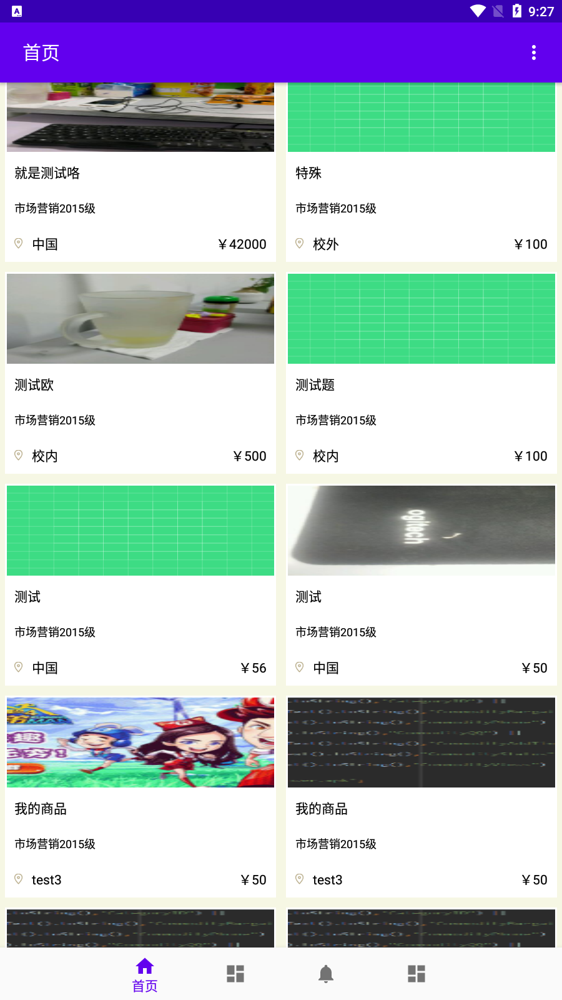

# CSMA_MVVM

#### 介绍
校园二手交易市场MVVM版本

#### 软件架构
软件架构说明

#### 安装教程

1.  安卓端不必说了；
2.  服务端用的是mysql+myeclipse，数据库在代码里面；

#### 效果图（deving...）

#### 引用资料

MVVM的架构来自：https://github.com/imyyq-star/MVVMArchitecture

其作者讲解框架的一些资料：

[MVVMArchitecture，一款可配置的 MVVM 框架]: https://juejin.cn/post/6854573214060789774
[DataBinding，让人又爱又恨的一]: https://juejin.cn/post/6857815150565687303

#### 特点

1. MVVM架构
2. 阿里Arouter组件化

